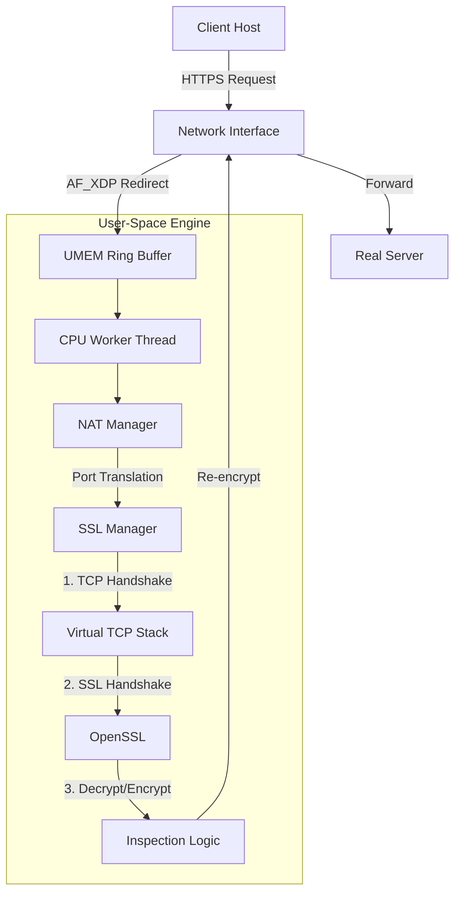

아래는 프로젝트의 핵심 기능인 **AF_XDP 기반 고성능 패킷 처리**와 우리가 깊게 고민했던 **SSL Proxy의 TCP/TLS 이슈 해결 과정**을 강조하여 작성한 `README.md` 초안입니다.

GitHub에 바로 붙여넣어 사용할 수 있도록 포맷팅했습니다.

---

# 🚀 AF_XDP SSL Proxy & NAT Engine

   

**High-Performance User-Space Network Appliance**

This project is a high-performance network traffic processor built on **AF_XDP (eXpress Data Path)**. It implements a complete **Transparent SSL/TLS Proxy (MITM)** and **NAT (Network Address Translation)** engine entirely in user-space, bypassing the kernel network stack for maximum throughput.

It is designed to inspect, intercept, and manage encrypted traffic with minimal latency using Zero-Copy drivers.

---

## 🌟 Key Features

### ⚡ **High-Performance Networking (AF_XDP)**
*   **Zero-Copy Packet Processing:** Direct DMA access to NIC buffers using `UMEM`, bypassing sk_buff and kernel overhead.
*   **Lock-Free Design:** Per-queue/Per-CPU worker threads with minimal lock contention.
*   **eBPF Integration:** Custom XDP programs for directing traffic to user-space sockets.

### 🔒 **Transparent SSL/TLS Proxy (The Core)**
*   **Full MITM Capability:** Intercepts HTTPS traffic transparently without client configuration.
*   **Dynamic Certificate Forging:** Generates X.509 certificates on-the-fly mimicking the target server.
*   **TLS 1.3 Support:** Fully compatible with modern TLS 1.3 strict security requirements.
*   **User-Space TCP Stack:** Implements a lightweight TCP state machine to handle Handshakes, ACKs, and retransmissions manually.

### 🌐 **Advanced NAT Engine**
*   **Sharded Connection Tracking:** Uses a sharded hash map (1024 shards) to handle massive concurrent flows with `std::shared_mutex`.
*   **Full Cone NAT / Symmetric NAT:** Supports complex NAT scenarios for WAN/LAN bridging.
*   **Seamless L2/L3 Routing:** Handles ARP resolution, Gateway MAC management, and subnet routing.

---

## 🏗️ Architecture Overview



---

## 🛠️ Technical Deep Dive & Challenges

Implementing a transparent SSL proxy on raw packets (AF_XDP) is significantly harder than using standard BSD sockets. We faced and solved critical challenges regarding **TCP Protocol Compliance** and **Modern Browser Security**.

### 1️⃣ The "Missing Byte" TCP Sequence Mystery
Since we manage raw TCP packets, we must manually calculate Sequence (`SEQ`) and Acknowledgment (`ACK`) numbers.
*   **The Issue:** During the `SYN` -> `SYN/ACK` -> `ACK` handshake, or when sending `FIN` packets, our proxy initially incremented the Sequence number twice (once in logic, once in the sender function).
*   **The Symptom:** This created a **1-byte gap** in the stream. The server received `Seq=2` instead of `Seq=1`, triggering an endless storm of **TCP Dup ACKs**, causing the connection to hang before `Server Hello`.
*   **The Fix:** Rigorous auditing of the TCP State Machine to ensure `SEQ` is incremented exactly once per consumed virtual byte (SYN/FIN flags).

### 2️⃣ Conquering TLS 1.3 & Browser Trust (`ERR_CERT_INVALID`)
Modern browsers (Chrome, Edge) strictly enforce X.509 standards, especially for TLS 1.3. Simply copying the Common Name (CN) is no longer enough.
*   **Strict Extensions:** We implemented a robust certificate generator including:
    *   **AKI (Authority Key Identifier) & SKI (Subject Key Identifier):** Essential for the browser to validate the trust chain from our Root CA.
    *   **Basic Constraints & Key Usage:** Explicitly marking certificates for `Server Auth`.
    *   **Random Serial Numbers:** Using `BIGNUM` for long, non-colliding serials to satisfy security policies.
    *   **Time Skew Handling:** Setting `NotBefore` to **-24 hours** to prevent `ERR_CERT_DATE_INVALID` caused by minor clock differences between the host and proxy.

---

## 💻 Code Structure

*   **`global.hpp`**: System-wide definitions, BPF headers, and 5-tuple hashing.
*   **`af_xdp_processing.hpp`**: The heart of the packet engine. Manages UMEM, RX/TX Rings, and CPU affinity.
*   **`ssl_manager.hpp`**: **(Highlight)** Contains the `OpenSSL` wrapper, Dynamic Certificate Authority, and the custom TCP/IP state machine for MITM.
*   **`nat_manager.hpp`**: Handles SNAT/DNAT logic with thread-safe sharded maps.
*   **`interfacemanager.hpp`**: Discovers system interfaces, gateways, and ARP tables.

---

## 🚀 Getting Started

### Prerequisites
*   Linux Kernel 5.10+ (for full XDP support)
*   `libbpf`, `libxdp`
*   `openssl` (dev)
*   `pcapplusplus`

### Build
```bash
mkdir build && cd build
cmake ..
make -j$(nproc)
```

### Run
*Root privileges are required to load eBPF programs.*
```bash
# Ensure your Root CA is generated at /root/VATEX/NDR_SENSOR/Certs/
sudo ./xdp_proxy_engine
```

### Root CA Installation
To prevent browser security warnings, install the generated `default_sensor_cert.crt` into your client machine's **Trusted Root Certification Authorities** store.

---

## ⚠️ Disclaimer
This tool is intended for **Network Analysis, Monitoring, and Security Research**. Intercepting SSL/TLS traffic without authorization is illegal. The authors are not responsible for any misuse of this software.